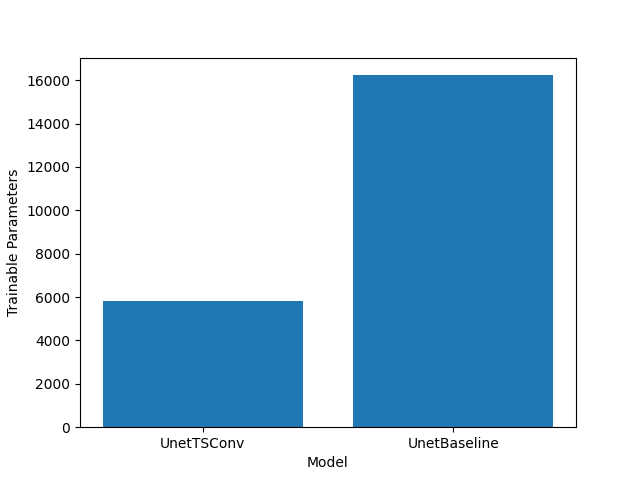

# adi-tsconv

## Author: [Thameem Abbas Ibrahim Bathusha](tabbas97@gmail.com)

Repository for take-home test as part of Round 2 of the interview with ADI

## Objectives

- [x] Implement a baseline UNet model with Conv2D Layers.
- [x] Implement a new layer architecture, time-shift convolution (TSConv) layer
- [x] Implement the improved UNet with the TSConv Layers.
- [x] Tests and documentation

## Installation/Setup

1. Install the required libraries using the following command:

    ```bash
    pip install -r requirements.txt
    ```

## Implementation Details

1. Pytorch is the library of choice for this implementation. Primarily due to the ease of use of the nn.Module.

2. Number of technical details are placed in Notes.md file.

3. The TSConv layer is implemented in the `tsconv.py` file. The TSConv layer is a special case of shift convolution where the shift is done only in the time dimension. If we find a case for frequency shift, we can extend the implementation to include that within 15 lines of additional code.

4. The tests for the models and layers are implemented in the `tests.py` file. I use the pytest library for testing. Most tests are parameterized to test the models with different input sizes and channels that we are expecting as of now. I use coverage pip module to verify code coverage.

5. The documentation is in the form of this README file. I have tried to keep the docstrings in the code the primary mode of understanding the usage of any function/module.

## Usage

As of now, the usage of the models will have to include the files in the root directory of the project. The models can be used as follows:

The model can be imported as follows:

```python
from unet import UNet

unet_baseline = UNet(
    conv = Unet.convOptions.get("baseline"), 
    batchnorm = <True|False>
    )

unet_tsconv = UNet(
    conv = Unet.convOptions.get("tsconv"), 
    batchnorm = <True|False>
    )
```

## Running the tests

To run the tests, you can use the following command:

```bash
coverage run -m pytest tests.py
```

To see the coverage report, you can use the following command:

```bash
coverage report -m
```

## Coverage as of last code change

| Name            | Stmts | Miss | Cover |
|-----------------|-------|------|-------|
| TSConv.py       | 6     | 0    | 100%  |
| UNet.py         | 42    | 3    | 93%   |
| blocks.py       | 122   | 0    | 100%  |
| layer_confs.py  | 4     | 0    | 100%  |
| shift_conv.py   | 40    | 5    | 88%   |
| tests.py        | 119   | 0    | 100%  |
|-----------------|-------|------|-------|
| TOTAL           | 330   | 8    | 98%   |

## Parameters Baseline vs TSConv UNet

